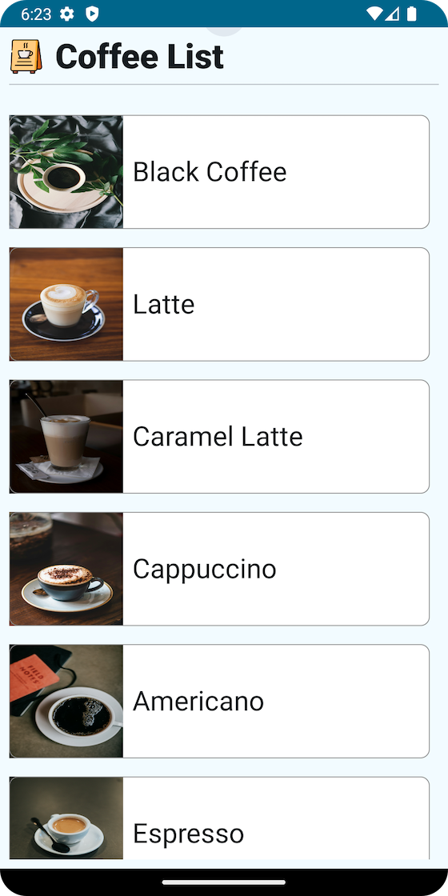

# Coffee App

Simple Coffee App, I use MVVM Architucre:
- Data Layer:
  1) I use room as local database storage.
  2) Retrofit used to handle Networking.
 
- Domain Layer: UseCase's, Domain-Models

- UI: Jetpack Compose

Download the apk file [here](coffee-app-release-unsigned.apk?raw=true)
